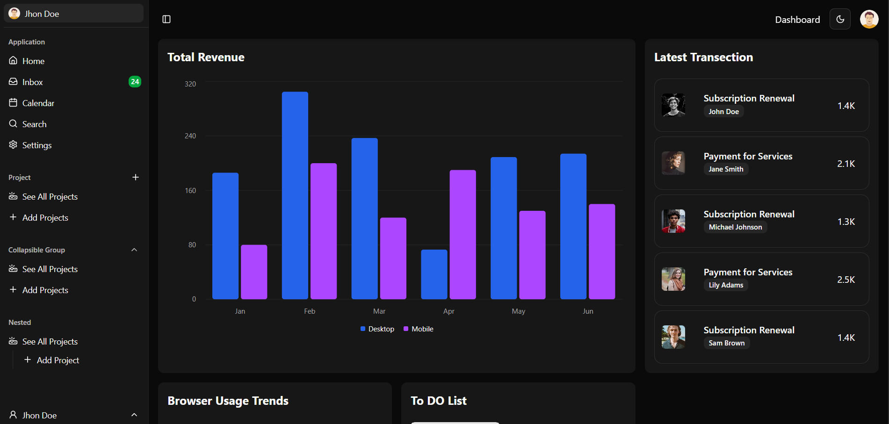

<div align="center">

    
       

</div>

# Modern Dashboard with Next.js and ShadCN UI



A modern, responsive dashboard application built with Next.js and ShadCN UI components, featuring data visualizations, user management, and a sleek design system.

## ✨ Features

- 📊 **Rich Data Visualizations**: Bar charts, area charts, and pie charts powered by Recharts
- 🎨 **Theme System**: Light/Dark mode with system detection
- 📱 **Responsive Design**: Mobile-first approach with adaptive layouts
- 🧩 **Modular Components**: Highly reusable UI components
- 📝 **Todo Management**: Interactive todo list with date picker
- 👤 **User Management**: Profile pages and activity tracking

## 🚀 Tech Stack

- [Next.js](https://nextjs.org) - React Framework
- [ShadCN UI](https://ui.shadcn.com) - UI Components
- [Tailwind CSS](https://tailwindcss.com) - Styling
- [Recharts](https://recharts.org) - Data Visualization
- [Next Themes](https://github.com/pacocoursey/next-themes) - Theme Management
- [React Hook Form](https://react-hook-form.com) - Form Management
- [Zod](https://zod.dev) - Schema Validation
- [date-fns](https://date-fns.org) - Date Utilities
- [Lucide Icons](https://lucide.dev) - Icons

## 📁 Project Structure

```
project/
├── src/
│   ├── app/                    # Next.js app router pages
│   │   ├── globals.css        # Global styles
│   │   ├── layout.tsx         # Root layout
│   │   ├── page.tsx           # Home page
│   │   ├── payments/          # Payments feature
│   │   └── users/            # User management
│   ├── components/            # React components
│   │   ├── ui/               # ShadCN UI components
│   │   └── providers/        # Context providers
│   ├── hooks/                # Custom React hooks
│   └── lib/                  # Utility functions
├── public/                   # Static assets
├── components.json           # ShadCN configuration
├── next.config.ts           # Next.js configuration
├── tailwind.config.ts       # Tailwind CSS configuration
└── package.json             # Project dependencies
```

## 🛠️ Installation

1. **Clone the repository**

```powershell
git clone <repository-url>
cd project
```

2. **Install dependencies**

```powershell
npm install
```

3. **Start the development server**

```powershell
npm run dev
```

4. **Build for production**

```powershell
npm build
```

## 💡 Key Features Explained

### Dashboard Components

- **Charts**

  - `Area Chart`: Time-series data visualization
  - `Bar Chart`: Comparative data visualization
  - `Pie Chart`: Distribution data visualization

- **Navigation**
  - `Sidebar`: Collapsible main navigation
  - `Navbar`: Top navigation with theme toggle
  - `Card-List`: Reusable card grid system

### User Interface

- **Form Elements**

  - Input fields
  - Select dropdowns
  - Checkboxes
  - Date pickers

- **Interactive Components**
  - Modal dialogs
  - Dropdown menus
  - Toast notifications
  - Tooltips

### State Management

- Theme context for appearance management
- Sidebar state with cookie persistence
- Form state handling with React Hook Form

## 🎨 Styling System

- CSS Variables for theme colors
- Tailwind utilities for rapid styling
- Custom animations
- Responsive breakpoints
- Dark mode support

## 🔒 Security Features

- Secure session management
- Form validation with Zod

## 📈 Performance

- Optimized image loading
- Font optimization
- Code splitting

<!-- ## 🧪 Testing

- Unit tests (planned)
- Integration tests (planned)
- E2E tests (planned) -->

## 📝 Code Style

- TypeScript for type safety
- ESLint configuration
- Consistent naming conventions
- Component documentation
<!-- - Copyright headers -->

## 🔥 Challenges Faced

### Technical Challenges

1. **Component Integration**

   - Ensuring proper hydration of server and client components
   - Managing component state across the application

2. **Performance Optimization**
   - Optimizing chart rendering performance
   - Reducing bundle size with large number of components

### Development Challenges

1. **Project Structure**

   - Organizing components for maximum reusability
   - Maintaining clean architecture with growing features

2. **Browser Compatibility**
   - Ensuring consistent behavior across different browsers
   - Handling different viewport sizes and resolutions

## 🚀 Future Aspects

### Planned Features

1. **Enhanced Analytics**

   - Real-time data visualization
   - Custom chart builder
   - Advanced filtering and sorting capabilities

2. **User Experience**

   - Improved accessibility features
   - More customization options

3. **Authentication & Authorization**
   - Multi-factor authentication
   - Role-based access control

### Technical Improvements

1. **Performance**

   - Progressive Web App (PWA) features

2. **Developer Experience**
   - Improved documentation
   - Component storybook

## 🔧 Configuration

### Next.js Config

```typescript
// next.config.ts
const nextConfig: NextConfig = {
  images: {
    remotePatterns: [
      {
        protocol: 'https',
        hostname: 'images.pexels.com',
      },
    ],
  },
};
```

### PostCSS Config

```javascript
// postcss.config.mjs
const config = {
  plugins: ['@tailwindcss/postcss'],
};

export default config;
```

## 📋 Requirements

- Node.js
- React
- npm
- Modern web browser

<!-- ## 🤝 Contributing

Contributions are welcome! Please read our contributing guidelines before submitting pull requests. -->

## 👤 Author

**Monayem Hossain Limon**

- GitHub: [@Limon00001](https://github.com/Limon00001)

<!-- ## 📄 License

Copyright © 2025 monayem_hossain_limon. All rights reserved. -->

<!-- ## 🙏 Acknowledgments

- ShadCN UI for the component library
- Next.js team for the amazing framework
- All contributors and maintainers -->

---

_Last updated: May 12, 2025_
